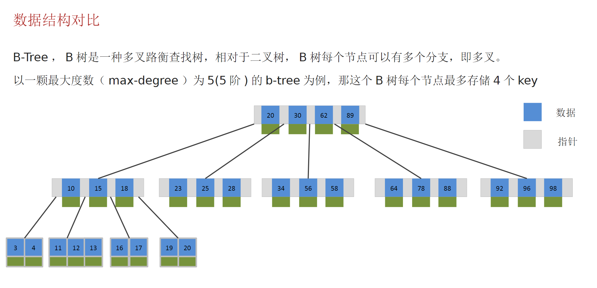
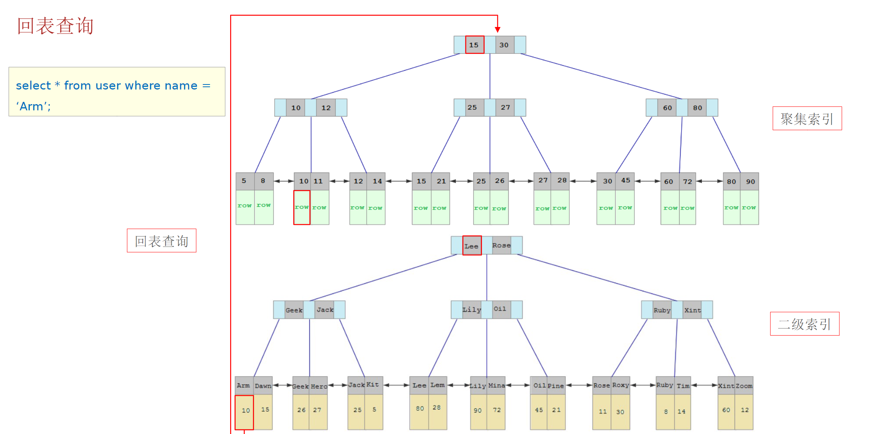

## 慢查询优化
可以使用EXPLAIN或DESC命令获取MySQL如何执行SELECT语句的信息

``` sql
explain select * from t_user where id = 1
```

| id | select_type | table | partitions | type | possible_keys | key | key_len | ref | rows | filtered | Extra |
| :----:| :----: | :----: | :----: | :----: | :----: | :----: | :----: | :----: | :----: | :----: | :----: |
| 1 | SIMPLE | t_user | NULL | const | PRIMARY | PRIMARY | 98 | const | 1 | 100.00 | NULL |

需要重点关注的字段
* possible_keys 当前sql可能会用到的索引
* key 当前sql实际命中的索引
* key_len 索引占用的大小
* Extra 额外优化建议
  * Using where; Using Index 查询使用了索引，需要的数据能全部在索引列中找到，不需要回表
  * Using index condition 查询使用了索引，但是需要回表查询数据
* type 这条sql的连接类型，性能由好到差为：NULL、system、const、eq_ref、ref、range、index、all
  * NULL：查询没有用到表
  * system：查询系统中的表
  * const：根据主键查询
  * eq_ref：根据主键查询或唯一索引查询，返回一条数据
  * ref：索引查询，可能时多条数据
  * range：范围查询
  * index：索引树查询
  * all：全盘扫描

## 索引
索引（index）是帮助MySQL高效获取数据的数据结构（有序）。在数据之外，数据库系统还维护着满足特定查找算法的数据结构（b+）树，这些数据结构以某种方式引用（指向）数据，这样就可以在这些数据结构上实现高级查找算法，这种数据结构就是索引。

B Tree

非叶子节点也会存储数据

B+ Tree 是在B Tree基础上的一种优化，使其更适合实现外存储索引结构， InnoDB 存储引擎就是用 B+Tree 实现其索引结构
所有数据存储在叶子节点，并且叶子节点是一个双向链表

## 聚集索引和非聚集索引
| 分类 | 含义 | 特点 |
| :----: | :----: | :----: |
| 聚集索引 | 将数据和索引存在一起，索引结构的叶子节点保存了整行数据 | 必须有且只存在一个 |
| 二级索引 | 将数据和索引分开存储，索引的叶子节点关联对应行的主键 | 可以存在多个 |

聚簇索引选取规则：
* 如果存在主键，主键索引就是聚簇索引
* 如果不存在主键，则第一个唯一索引作为聚簇索引
* 如果表没有主键和唯一索引，则Innodb会自动生成一个rowid作为隐藏的聚簇索引

## 回表查询
回表查询：通过非聚簇索引找到对应的主键值，然后根据主键值找到聚集索引中对应行的整行数据，这个过程就是回表


## 覆盖索引
指查询用到了索引，并且返回需要的列，在该索引中已经全部找到

## 索引的创建原则
1. 数据量大，且查询频繁的表（单表超过10w）
2. 常作为查询条件、排序、分组的字段
3. 字段内容区分度高
4. 内容较长的使用前缀索引
5. 尽量使用联合索引，避免回表
6. 要控制索引的数量
7. 如果索引列不能为null，要使用not null约束

## 索引失效
1. 违反最左前缀法制 指的是查询从索引的最左前列开始，并且不跳过索引中的列
2. 范围查询右边的列，不能使用索引、
3. 不要在索引列商最运算操作，索引将失效
4. 字符串不加单引号，有可能会导致索引失效（类型转换会导致索引失效）
5. 以‘%’开头的Like模糊查询，索引失效

## SQL优化
1. SELECT 语句必须指明字段名称（不使用select *）
2. 避免索引失效的写法
3. 尽量使用union all代替union
4. 避免在where子句中对字段进行表达式操作
5. join优化 能用inner join就不用`left\right join`，如必须使用，则以小表为驱动

# 事务特性 ACID
事务时一组操作的集合，它是一个不可分割的工作单位，事务会把所有的操作作为一个整体一起向数据库提交或撤销，即这些操作要么全部同事成功，要么同时失败
* 原子性（Atomicity）：事务是不可分割的最小操作单元，要么全部成功，要么全部失败
* 一致性（Consistency）：事务完成时，必须使所有数据保持一致状态
* 隔离性（Isolation）：数据库系统提供隔离机制，保证事务在不受外部并发操作的影响下的独立环境运行
* 持久性（Durability）：事务一旦提交或回滚，他对数据库中的数据改变就是永久的

## 并发事务
| 问题 | 描述 |
| :--: | :--: |
| 脏读 | 一个事务读到另外一个事务还未提交的数据 |
| 不可重复读 | 一个事务先后读取同一条数据，但是2此读取的数据不同 |
| 幻读 | 一个事务按照条件查询数据时，没有对应的数据行，但是在插入时，又发小这行数据已经存在，好像出现‘幻影’ |

| 隔离级别 | 脏读 | 不可重复读 | 幻读 |
| :--: | :--: | :--: | :--: |
| Read uncommitted 未提交读 | √ | √ | √ |
| Read Committed 读已提交 | x | √ | √ |
| Repeatable Read（默认）可重复读 | x | x | √ |
| Serializable 串行化 | x | x | x |

## 日志
* redo log：记录的是数据页的物理变化，服务器宕机可用来同步数据
* undo log：记录逻辑日志，当事务回滚时，通过逆操作恢复原来的数据
* redo log保证事务持久性、undo log保证事务原子性和一致性