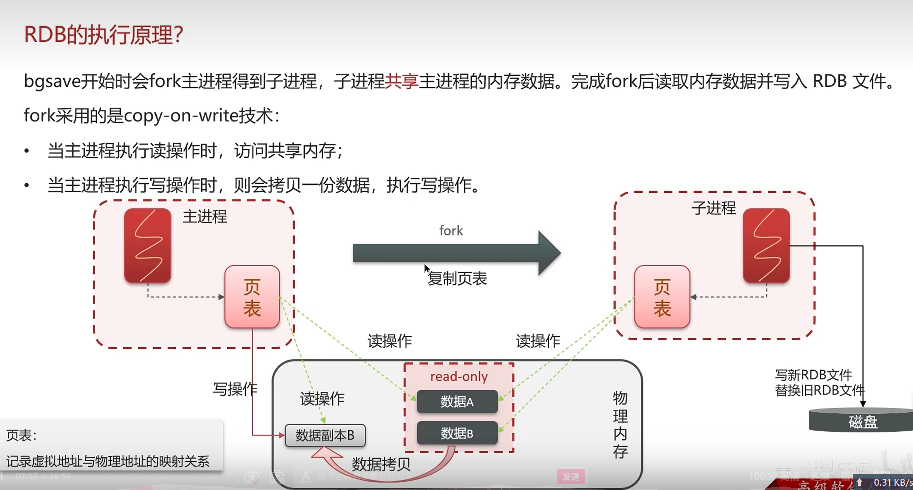

# 缓存

## 1.Redis的使用场景

* 根据简历上的项目进行回答
* 缓存（穿透、击穿、雪崩、双写一致、持久化、数据过期、淘汰策略）
* 分布式锁（setnx、redisson）

## 2.什么是缓存穿透，怎么解决

* 缓存穿透：查询一个不存在的key，MySQL查询不到也不会写入Redis，导致每次请求都调用数据库
* 解决方案1：缓存空数据、实现简单，Redis压力大
* 解决方案2：布隆过滤器、实现复杂，缓存预热记录布隆过滤器

## 3.什么是缓存击穿，怎么解决

* 缓存击穿：给某一个key设置了过期时间，过期期间大量并发请求进入，压垮数据库
* 解决方案1：互斥锁、强一致、性能差
* 解决方案2：逻辑过期、高可用、不能保证数据绝对一致

## 4.什么是缓存雪崩，怎么解决

* 缓存雪崩：同一时间段大量key同时过期或Redis服务器宕机，导致大量请求打到数据库
* 解决方案1：随机Ttl值
* 解决方案2：Redis集群
* 解决方案3：限流降级 nginx、spring-cloud-gateway
* 解决方案4：多级缓存 Guava、Caffeine

## 5.Redis缓存如何与MySQL进行数据同步（双写一致）
* 先介绍业务
* 一致性要求高（强一致）
* 允许延迟一致

1. 延时双删
   1. 先删除缓存还是先删除数据库
   2. 为什么删除2此缓存
   3. 为什么要延时删除

2. 读多写少：读时添加共享锁（readLock），写时添加排他锁（writeLock）
3. 异步通知保证最终一致性
   1. MQ：更新数据后，消息通知缓存删除
   2. Canal：读取binlog日志更新缓存

## 6.Redis数据持久化
1. RDB（数据快照）：把内存中所有数据文件记录到磁盘，Redis启动从磁盘快照恢复数据

2. AOF（追加文件）：把Redis的每一个命令记录在AOF文件

## 7.Redis数据过期策略
1. 惰性删除：需要key的时候检查是否过期，如果过期则删掉，否则返回key
   * 优点：CPU消耗小，只会在使用时过期检查
   * 缺点：内存不友好，如果一个key一直不使用，那么这个key会一直存在内存中，内存不会释放
2. 定期删除：每隔一段时间，对一些key检查，删除过期的key
   * SLOW：定时任务，每秒10次，每次不超过25ms
   * FAST：执行频率不固定，间隔不低于2ms，每次耗时不超过1ms

实际上Redis是惰性删除、定期删除两种结合使用

## 8.Redis数据淘汰策略
当Redis内存不够用的时候，继续往Redis添加数据，那么Redis会按照一定的规则将内存中的数据删掉，这种删除的规则被称为内存的淘汰策略
Redis支持8钟不同的策略来选择要删除的key：
* noeviction：不淘汰任何key，内存满时不允许写入任何新数据，默认时这种策略
* volatile-ttl：对设置了ttl的key比较ttl，ttl越小越先淘汰
* allkeys-random：对全体key随机淘汰
* volatile-random：对设置了ttl的key，随机进行淘汰
* allkeys-lru：对全体key，基于lru进行淘汰
* volatile-lru：对设置了ttl的key，基于lru淘汰
* allkeys-lfu：对所有key，基于lfu淘汰
* volatile-lfu：对设置了ttl的key，基于lfu淘汰

## 9.Redis集群方案
1. 主从
2. 哨兵
3. 分片

## 10.Redis是单线程的，为什么会这么快？
* Redis是纯内存操作，执行速度非常快
* 采用单线程，避免不必要的线程上下文切换竞争，多线程还需要考虑线程安全问题
* 使用I/O多路复用模型，非阻塞I/O
  * Redis是纯内存操作，执行速度非常快，主要性能瓶颈是网络延时而不是执行速度，I/O多路复用模型就是为了实现高效网络请求
  * 利用单个线程同时监听多个Socket，并在某个Socket可读、可写时得到通知，从而避免无效等待，充分利用CPU资源